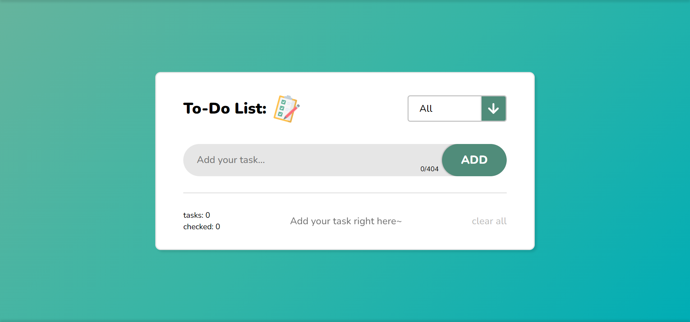

# First To-Do List

📄 **todoapp** - это проект написанный ради общей практики базового стека технологий (**HTML**, **CSS**, **JavaScript**). Реализовано нарочито без использования сторонних _библиотек_ и _фреймворков_. Это гибкий и адаптивный **To-Do List**, создававшийся по всем канонам первого пет-проекта "тудушки". С несколькими важными для меня, но:

- Проект должен быть действительно <u>гибким</u> в использовании ✔️;
- Он должен <u>реально</u> выполнять заложенные в него задачи ✔️;
- И чтобы его было возможно <u>масштабировать</u> спустя время ✔️;

---

## about:

1. 📑 В ходе разработки использовал все следующие подходы:

> ---
>
> > **HTM󠀠󠀠L5 & CSS3:**
>
> - _BEM_ - методология наименования классов;
> - _Отзывчиво адаптивной верстка_;
> - _Поддержка кроссбраузерности_;
>
> > **JavaScript ES6+:**
>
> - _JSDoc_ - система документации проекта улучшающая читаемость кода;
> - _const prefer_ - подход по объявлению переменных предпочтительно _const_ и в ином случае _let_;
>
> > _local/session storage_, _HTML Drag and Drop API_ и еще всякое разное...
>
> ---

2. 📑 Реализовал весь задуманный функционал для гибкой работы:

- Работа с тасками 📝:
  - Добавление;
  - Перетаскивание;
  - Изменение;
  - Удаление;

* Сортировка элементов 📝:
  - Присвоение статуса;
  - Сортировка по статусу;
  - Подсчет количества;

- Работа с данными приложения 📝:
  - Сохранение;
  - Изменение;
  - Вывод;

```
> P.s. А так же комфорт, и логичность UI/UX дизайна, тут уж старался как мог 😄 ~
```

## warning:

> 📌 _Работа над проектом прекращена:_
>
> > **todoapp** _- это мое первое полноценное веб-приложение_ 👍
>
> **P.s.** _сделал все возможное для качества читаемости кода и фикса багов..._

---

<h1 align="center"><a href="https://lapard1n.github.io/todoapp">todoapp:</a></h1>



---
